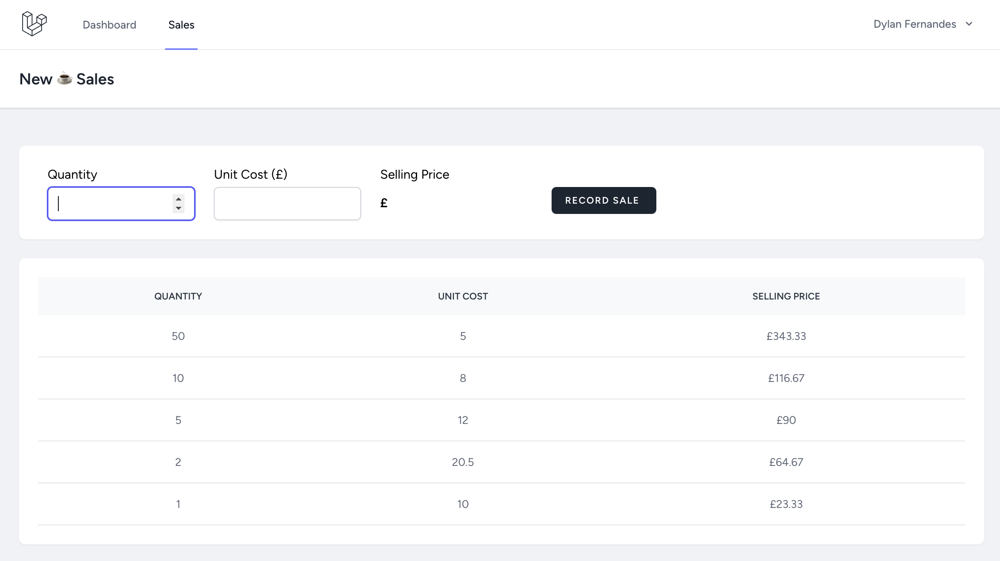
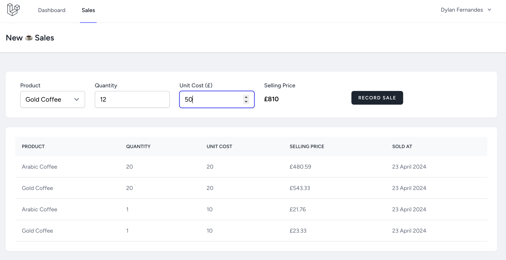

# Competence Development Laravel Task

Laravel/vue implementation of calculation and recording sale of coffee
products

## Part 1 (Screenshot)



## Part 2 (Screenshot)



## Installation

Part 1 has been git tagged as 1.1, the latest commit would
render Part 2.

### Install composer packages
```shell
composer install
```

### Install npm packages
```shell
npm install
```

### Seed the Coffee table using
```shell
php artisan db:seed --class=CoffeeSeeder
```

### Build frontend resources
```shell
npm run build
```

### Copy .env file
```shell
cp .env.example .env
```

### Run backend server
```shell
php artisan serve
```
Navigate to served url and register an account at `/register`
then login at route `/login`

### Run tests using
```shell
php artisan test
```
